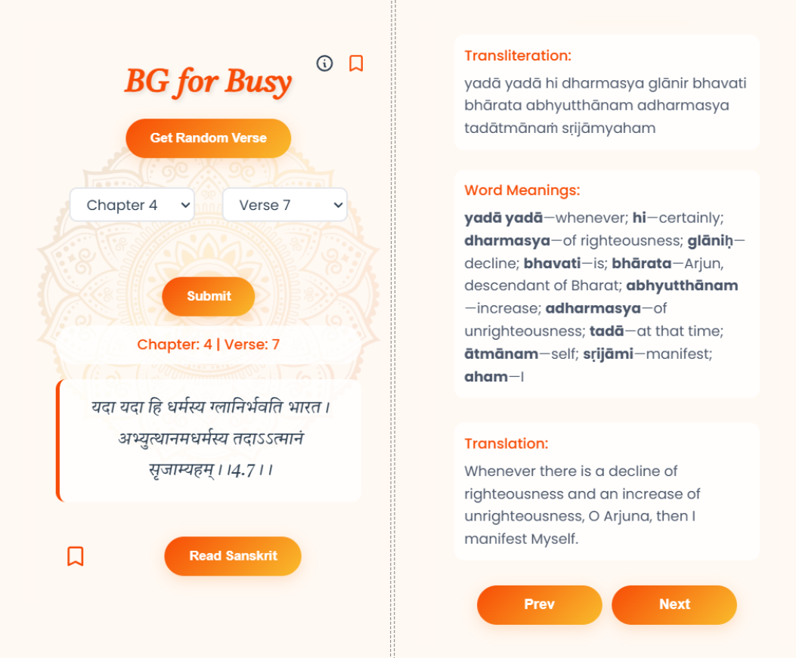

<!-- #  -->
# BG for Busy Extension


##  Preview


## 🌟 Motivation

In today's fast-paced digital world, it's easy to get distracted. Whether we're working, browsing Chrome, or using various tools, a quick detour to platforms like YouTube can pull us away from our focus. As a spiritual person, I wanted to read the Bhagavad Gita (BG) regularly, but I often found it hard to carve out dedicated time for it.

That's why I built the **BG for Busy** browser extension — to effortlessly integrate spirituality into my daily workflow by reading and reflecting on verses even while working.

---

## 📚 Table of Contents

- [Features](#🚀-features)
- [Installation](#🛠️-installation)
- [Usage](#✨-usage)
- [Upcoming](#🌟-upcoming-features)
- [License](#📜-license)
- [Contributing](#🤝-contributing)
- [Contact](#contact)

---

## 🚀 Features

- 🎯 **Select specific verse**: Choose any *Bhagavad Gita* verse you'd like to read.
- 🔀 **Get random verse**: Perfect for quick spiritual inspiration.
- ⭐ **Save verses**: Bookmark your favorite verses for easy access later.

---

## 🛠️ Installation

1. Clone this repository:
   ```bash
   git clone <repository-url>
   ```
2. Open Chrome and go to `chrome://extensions/`.
3. Enable **Developer mode** (top right corner).
4. Click **Load unpacked** and select the project folder.
5. The extension should now appear in your browser toolbar.

---

## ✨ Usage

1. Click the extension icon in your Chrome toolbar.
2. Use the options in the popup to select or fetch a verse.
3. Save any verse you want to revisit.
4. Stay inspired, stay focused!

---

 
## 🌟 Upcoming Features

- **Search option** to quickly find specific verses.  
- **Authentication** to save and sync favorite verses across devices.  
- **Notes and comments** feature to jot down thoughts or reflections on verses.  
- **Read options** allowing customization of font sizes, themes, and display preferences.  

---

## 🚀 Future Aspects  

Looking ahead, the **BG for Busy** extension aims to cross boundaries by evolving into an **AI-powered chatbot**. This chatbot will not only answer user queries directly from the **Bhagavad Gita** but also pull authentic content from other spiritual texts like the **Puranas**, **Vedas**, and **Bhagavatam**. The goal is to provide a reliable, AI-guided experience for anyone seeking spiritual progress, offering verified answers and **stories rooted in bhakti** rather than opinion-based content.  

 
---

## 📜 License

This project is licensed under the MIT License.

---
## 🤝 Contributing
Contributions are welcome! Please open an issue or submit a pull request.

---

## 📞 Contact

Created with 💖 by [Navjeevan Alone](mailto:navjeevanalone352@gmail.com) — feel free to get in touch!

